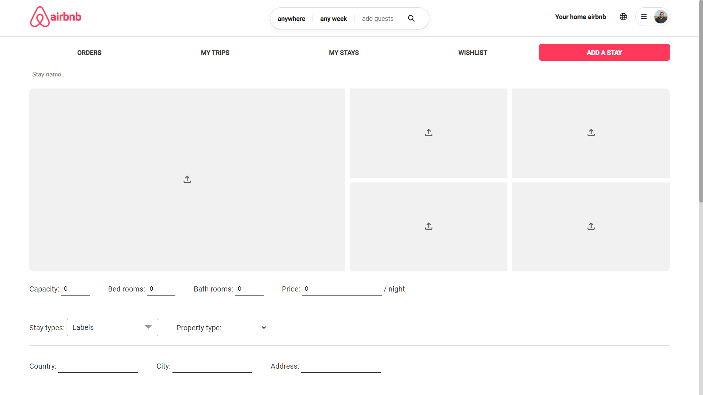

# Airbnb - pixel perfect, E2E clone of Airbnb (Angular + Node.js)

Welcome to this Airbnb clone built with Angular, TypeScript, Rxjs, and SCSS. This project is designed to mimic some of the functionalities of Airbnb.com such as search for specific locations, filter search results according to user preferences, select dates for check-in and check-out and view accommodation details, become a host and post stays and get notification in live with Socket.io.
[Here is my project link](https://airbnb-rktw.onrender.com/ "Airbnb link").

For those of you who are already familiar with Airbnb, we added some interesting and unique features - [features](#application-features).
If you are not familiar with the App, read about it [here](#airbnb-description).
And, if you are tired and just want to see some images of the website, [scroll to the bottom...](#showcase)

[Link to backend repository](https://github.com/oferGavrilov/AirBNB-backend "backend repository").
___

### Table of Contents
- [Airbnb Description](#airbnb-description)
- [Application Features](#application-features)
- [Technologies](#technologies)
- [Getting started](#getting-started)
- [Showcase](#showcase)

## Airbnb Description
Airbnb is an app in which you can rent a stay around the world and highlight your stays as a host.
In this app you can use advanced searches for best experience and also you can print and export for csv file.
This app is a end-to-end project with full responsive styles with the best user experience of original Airbnb.
Every thing Airbnb has, we also had. 
More about it in the [features section](#application-features).

## Application Features
- Search functionality: Users can search for specific locations using a variety of filters including location, date range, number of guests.
- Booking: Upon finding a suitable listing, users can book the accommodation by filling out relevant information such as number of guests, duration of stay, contact info, payment method, etc.
- I18n Translation: In this app, users can choose the language of their own choice.
- Live Notifications: Users can be notified when host changes the status of order, host can be notified when user order his place.
- Print & export to CSV file: By selecting order users can print and export for CSV files.
- Responsive design: The website was optimized to be viewed on multiple devices of different sizes.

Of course that we included all the small nuances Airbnb has. You are not supposed to find any differences! 

You are more than welcome to ***check it out*** ( [right here](https://airbnb-rktw.onrender.com/ "Github pages link"))

## Technologies

The technology stack we used was MEAN - ***MongoDB***, ***Express***, ***Angular***, ***Node.js***.
The app uses webSockets to update the orders in real-time.
The API calls to the backend are done with the ***REST API*** method.

We have used many third side libraries for many goals like ***Google-maps, Angular-Material, Font-Awesome, Ngx-Translate, Socket.io, Ngx-CSV, Ngx-Star-Rating.*** 

## Code scaffolding

Run `ng serve` for a dev server. Navigate to `http://localhost:4200/`. The application will automatically reload if you change any of the source files.

Run `ng generate component component-name` to generate a new component. You can also use `ng generate directive|pipe|service|class|guard|interface|enum|module`.

## Build

Run `ng build` to build the project. The build artifacts will be stored in the `dist/` directory.

## Running unit tests

Run `ng test` to execute the unit tests via [Karma](https://karma-runner.github.io).

## Running end-to-end tests

Run `ng e2e` to execute the end-to-end tests via a platform of your choice. To use this command, you need to first add a package that implements end-to-end testing capabilities.

## Showcase

### Homepage
The home page in which the user can sign up / login, filter stays by countries and navigate to about page.

### Stay
In Stays page users can filter stays by countries by dates and by sum of guests,
Also the users can like a place and add it to their wishlist.
After find a nice place the users can navigate to stay details for more information and send a order request for the host.

### Login & Signup
We created an e2e authentication flow, including encrypting the users details.

### Stay details
Here the users can explore more information about any place they choose to see, and send a order request to the host, they can also add their own review and rating by stars.

### User Page
Here users can post new stays, watch their wishlist, their trip list, their own stay list and their order list and there they can approve or decline orders of another users.

### Internationalization Translation
In our app users can choose their favorite language!

### About us
And finally we designed a page for you with a little information about us 😉

### Some mobile!
Just a taste of the mobile experience. We used different **mixins**, **conditional rendering**, and the **"mobile first"** approach. 
The layout we have built from the very first moment enabled us to make the website responsive without a lot of effort.

### Authors
 - [Idan David](https://github.com/idandavid1)
 - [Ofer Gavrilov](https://github.com/oferGavrilov)

